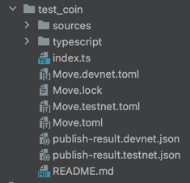

# Core of Scallop lending protocol on SUI network

## How to use

1. Install npm packages

```bash
pnpm install
```

2. Install SUI cli
See the official documentation: [How to install SUI cli](https://docs.sui.io/devnet/build/install)

3. Set the envs
  ```bash
  cp .env.example .env
  ```
  - `SECRET_KEY`: The secret key of the account that will be used to deploy the contracts, make sure the account has enough SUI to pay for the transaction fees
  - `SUI_NETWORK_TYPE`: The network type of the SUI network. It can be `devnet`, `testnet`, `mainnet` or `localnet`


## Move package structure
We use typescript to publish & interact with the contracts, and we make some improvements to the package structure to make it easier to use.

Let's take the `test_coin` package as an example:



- `sources` folder contains all the move contract code.

- `typescript` folder usually contains the typescript code that will be used to deploy & interact with the contract.

- `publish-result.${networkType}.json` contains the important object ids of the contracts for each network type.

- `index.ts` export the typescript code in the `typescript` folder.

- `Move.${networkType}.toml` is the toml file for each network type.

- `Move.toml` is the default toml file, it will be used if the `Move.${networkType}.toml` for the current network type is not found.

- `README.md` description of the package, explain the usage of the package.

## Learn More About the Project with LLM 

We recommend using [DeepWiki](https://deepwiki.com/scallop-io/sui-lending-protocol) to gain a deeper understanding of the project's architecture, core concepts, and implementation details.

## Use Scallop SDK to interact with the contracts

It's recommended to use the Scallop SDK to interact with the contracts, see the official documentation: [How to use Scallop SDK](https://github.com/scallop-io/sui-scallop-sdk)

or even generate demo code and transaction examples directly through [DeepWiki](https://deepwiki.com/scallop-io/sui-scallop-sdk)’s integrated LLM interface.

## Integrate with Scallop Protocol in SUI Move

The protocol is designed to be simple, efficient, and secure.

Moreover, the protocol is designed to be composable, meaning that other protocols can easily integrate with it.

[Contract integration guide](contract-integration.md)
