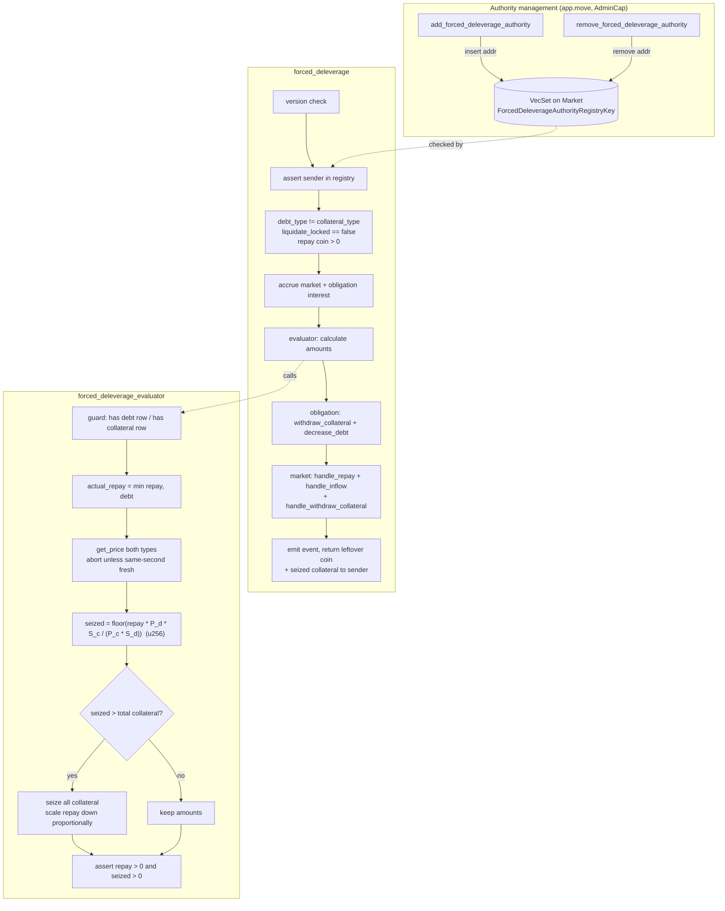

# Forced Deleverage — review notes (commit 892cd10)

My security review of Nathan's `feat: forced deleverage`, on branch
`chore/forced-deleverage-review`.

**What it does.** Winds down a deprecated asset (e.g. SCA once Pyth drops the
feed): an address in a Market-held registry repays a chosen `DebtType` on any
obligation and takes `CollateralType` of equal USD value at oracle prices. No
liquidation discount, no revenue cut, no health gate, no owner consent.

**Bottom line.** Sound. I read all nine areas (R1–R9) line by line — no
exploitable vulnerability, no contract change needed. What remains is
design-level risk I've accepted (below) and three hardening notes for Nathan.
34 tests for this feature, full suite 87/87.

## How it works



```
executor coin (DebtType)  --repay part-->  market reserve (cash+, debt-)
obligation debt  (DebtType)       -= actual_repay
obligation collateral (CollType)  -= seized_amount --> executor
market collateral_stats (CollType) -= seized_amount
leftover repay coin  -->  back to executor
```

Nathan's two scenarios are the same call, differing only in which side is
deprecated: deprecated borrow asset → it's the `DebtType`; deprecated
collateral asset → it's the `CollateralType`.

| Changed file | Change | Notes |
|---|---|---|
| `app.move` | add/remove authority + events | R1 |
| `market_dynamic_keys.move` | `ForcedDeleverageAuthorityRegistryKey` | R1 |
| `user/forced_deleverage.move` | new module (main flow) | R2, R3, R6, R8 |
| `evaluator/forced_deleverage_evaluator.move` | new module (amount math) | R5 |
| `market/reserve.move` | `util_rate` saturation fix | R7 |
| `error/error.move` | 4 new error codes | R9 |
| `market/market.move`, `obligation/obligation.move` | `friend protocol::forced_deleverage` | R9 |

R4 covers `price.move` and the x_oracle/pyth pipeline — unchanged by this
commit, but the evaluator's fairness rests on it, so I read it before R5.

## What I checked

### R1 — authority registry
Files: `app.move:437`/`:460`, `market_dynamic_keys.move:37`.
- Both functions are `&AdminCap`-gated. The registry is a typed dynamic field
  on Market; the only mutable-UID paths are `market::uid_mut` (friend-only) and
  `uid_mut_delegated` (needs the protocol `Publisher`, `x/sources/witness.move:13`),
  so nobody else can touch it. Add/remove emit events.
- Deliberately NOT version-gated, and I'm fine with it: none of the 32
  `AdminCap` functions in `app.move` are. Version gates protect user-facing /
  sender-ACL paths — `freeze_protocol` (`app.move:409`) has one precisely
  because anyone in the pause registry can call it. A version bump doesn't
  revoke the AdminCap, so gating admin functions buys nothing.
- Duplicate `add` and missing-entry `remove` abort loudly — good: a typo'd
  revocation should fail visibly, and the empty-set `remove` creates at
  `app.move:468` rolls back with the abort.

### R2 — entry points and preconditions
Files: `forced_deleverage.move:43` (entry), `:69` (main), `:148` (ACL).
- ACL is fail-closed: no registry → unauthorized; sender not in set →
  unauthorized. `tx_context::sender` is the signer, so a wrapper package can't
  spoof it — the composable `public fun` is safe.
- Version check first; same-type self-swap blocked; zero coin blocked; no
  `ObligationKey` — it's a forced operation. Entry wrapper mirrors
  `liquidate_entry`.
- Two deliberate differences vs liquidate: only `liquidate_locked` is honored
  (repay/withdraw locks and the whitelist freeze do NOT stop it — a lock or a
  freeze must not shield a deprecated asset from wind-down), and there is no
  whitelist check (the dedicated ACL is strictly tighter). Integrators that key
  on obligation state need to watch `ForcedDeleverageEvent`.

### R3 — interest accrual ordering
Files: `forced_deleverage.move:102`, `market.move:363`/`:226`, `obligation.move:137`.
- market → obligation → evaluator, same as `liquidate.move:110`. The evaluator
  sees post-accrual debt, so the repay cap includes interest up to this second;
  over-repay is unreachable.
- `now` is computed once; after `accrue_all_interests(now)` every asset has
  `last_updated == now`, so `handle_repay`'s freshness assert always holds. The
  re-entry into `accrue_all_interests` inside `handle_withdraw_collateral`
  no-ops on the skip guard (`market.move:374`).
- The evaluator takes no `&Market` — par conversion needs only prices and
  decimals. Smaller surface than liquidation's.

### R4 — oracle dependency
File: `price.move:13` — `get_price` aborts unless same-second fresh and nonzero.
- The executor cannot forge prices (Pyth-signed), substitute feeds
  (`pyth_rule/rule.move:30`), roll back prints, or use wide-confidence prints
  (`pyth_adaptor.move:53`). What it CAN do is time the call and cherry-pick
  within each feed's 30 s window (`pyth_adaptor.move:50`) — the same freedom
  liquidators already have.
- With ≥1 secondary rule the primary is bounded to ±1% of ⌈n/2⌉ secondaries
  (`x_oracle.move:217`,`:244`); with 0 secondaries there is no cross-source
  bound (integer division makes the requirement 0).
- APM is deliberately not consulted: it's one-directional (up-moves only,
  `apm.move:95`), guards borrow/withdraw, `liquidate` skips it too, and it
  aborts on assets without APM state — exactly the deprecated assets this
  feature targets.

### R5 — evaluator math
File: `forced_deleverage_evaluator.move:30`.
- Row guards require `amount > 0` (zero rows are deleted from wit-tables).
- `seized = repay·raw_d·S_c / (raw_c·S_d)` — the 2^32 factors cancel; this is
  liquidation's base exchange rate (`liquidation_evaluator.move:186`) minus
  discount/revenue, computed in one u256 floor instead of chained FixedPoint32
  ops, so precision is strictly better.
- Overflow impossible (triple product ≤ 2^192); division by zero impossible
  (raw ≥ 4 on the 9-decimal feed, `S_d ≥ 1`); both u64 casts sit after the
  collateral cap and provably fit.
- Rounding. Normal path: seized is floored — borrower keeps the dust, executor
  never gets more than par. Short path: two floors compose in opposite
  directions (`needed` floors down, which pushes the scaled repay up), so the
  deviation from par is two-sided — executor under by ≤ 1 debt unit or over by
  ≤ the value of 1 collateral unit; the protocol never loses. Pinned by
  `forced_deleverage_collateral_shortfall_with_remainder_test`.
- No 20% per-call cap, no dust threshold — intentional; full single-call
  clearance is the point of a wind-down. The final `> 0` asserts reject both
  free-repay and free-collateral dust cases.
- Health, precisely: the liquidation buffer (liq value − weighted debt)
  strictly improves by X·(borrow_weight − liq_factor) > 0 per repaid value X.
  The risk *ratio* improves only while it is below 1/liq_factor — deeply
  underwater it worsens even as the deficit shrinks. Pinned by
  `forced_deleverage_deep_insolvency_deficit_shrinks_test`.

### R6 — accounting
File: `forced_deleverage.move:115`.
- No bespoke ledger path anywhere: debt side is normal repay's exact trio
  (`repay.move:76`,`:79`,`:82` — `handle_repay`, `handle_inflow`,
  `decrease_debt`); collateral side is normal withdraw's exact market call
  (`withdraw_collateral.move:106`) plus `obligation::withdraw_collateral`.
- All four subtractions provably can't underflow (evaluator caps, split bound,
  global stat ≥ per-obligation amount). The `reserve::handle_repay` overshoot
  branch (`reserve.move:176`) absorbs rounding drift into revenue instead of
  aborting.
- `update_interest_rates` runs twice per call — benign; final rates come from
  the final balance sheet, and reusing two existing handlers beats adding a
  bespoke reserve function.

### R7 — util_rate saturation fix
File: `reserve.move:131`.
- `revenue > cash` is passively reachable: every accrual grows revenue without
  adding cash (`reserve.move:154`); the `cash >= revenue` asserts only gate
  active ops. The old formula then produced util > 1, which aborted
  `calc_interest` (`interest_model.move:205`) on every accruing path —
  including the repay that would fix it. Whole pool bricked.
- The fix is byte-identical in behavior while `cash >= revenue` and saturates
  at exactly 100% otherwise (`calc_interest` accepts util == 1). It ships here
  because wind-downs target drained pools — where the old code aborts — and
  the forced repay itself runs through `util_rate`.
- See hardening #2 for the mint asymmetry the saturation uncovers.

### R8 — event
File: `forced_deleverage.move:31`.
- Amounts are the post-cap actuals. Prices in the event are provably the same
  ones the math used (one atomic call, same-second freshness on both reads), so
  anyone can recompute `seized` from the event alone and verify fairness.
  Shape matches `LiquidateEventV2`; with the R1 add/remove events the audit
  trail has no blind spot.

### R9 — error codes, friend surface, upgrade
- 4 new codes under a fresh `0x0017` prefix; `error_code_uniqueness_test`
  passes.
- Friend surface is minimal: only the seven functions repay/withdraw already
  use, none of the dangerous ones (`uid_mut`, `handle_borrow`, `take_revenue`,
  `increase_debt`, `set_lock`, `deposit_collateral`). The evaluator needs no
  friend grant at all.
- Upgrade-safe: everything is additive (two new modules, one key struct, new
  friend declarations — not public ABI); `util_rate` changes body only. No
  migration: the registry is created lazily and its absence is fail-closed.
  `forced_deleverage` asserts the current version, so a bump retires the
  execution path with the rest of the package.

## Accepted risks

- **Broad authority.** An authorized executor can force-swap a healthy,
  non-consenting user's collateral at 1:1 oracle value, any obligation, any
  pair, up to the full amount. That's the feature. A compromised key's blast
  radius is "swap at fair value", not theft. Mitigation: the registry holds a
  multisig only.
- **Oracle is the only fairness anchor.** No APM, no health gate; fair value
  rests on the price pipeline within the 30 s Pyth window — same freedom
  liquidators have. Accepted with the multisig executor; I waived the on-chain
  secondary-rule config check.
- **Works during freeze; ignores repay/withdraw locks.** Required, or a lock or
  freeze could shield a deprecated asset. Integrators must index
  `ForcedDeleverageEvent`.

## Hardening notes for Nathan (non-blocking)

1. Registry should hold a dedicated multisig only; consider a deprecated-asset
   allowlist to bound the authority's scope.
2. `mint_market_coin` lacks the `cash >= revenue` guard its siblings have
   (`reserve.move:225`). With util saturation no longer aborting in the
   `revenue > cash` regime, mint succeeds there while redeem stays blocked — a
   deposit-only state whose fresh cash is sweepable by admin `take_revenue`.
   Not attacker-reachable (asset-active + whitelist + supply-limit gate it),
   but add the guard or deactivate the asset before a pool gets there.
3. Wording: "exactly equal USD value" means equal at the oracle's quantized
   price — the `create_from_rational` floor matters only below ~$1e-8 per
   whole token. Docs nit, no code change.

## Test coverage

`forced_deleverage_test.move` (33) + `util_rate_test.move` (1); full suite
87/87. I audited Nathan's 20 against my plan, closed the two gaps (same-type
abort, direct health assertion), then added adversarial state-integrity tests
and a final necessity pass (short-path double-floor remainder, short-path dust,
APM bypass). Found nothing to remove. Every abnormal path left the protocol
state exact — no contract change came out of testing.

Behavior and aborts: par-value happy path (+ asymmetric decimals replaying the
u256 formula from on-chain raws); repay capped at debt with refund;
collateral-short scaling, exact and with remainder (the latter pins R5's
two-sided rounding bound); row deletion at zero; same-type abort (`0x0017004`);
unauthorized × 3 (registry absent / unknown sender / removed); missing debt or
collateral row; stale price; zero coin; both dust guards — normal path
(`seized == 0`) and short path (`scaled_repay == 0`); authority add/remove
edges; util_rate saturation; lock bypass; works-while-frozen (real
`freeze_protocol`); APM bypass (a 3× same-second pump that would block
borrow/withdraw doesn't block the wind-down); liquidate-rejects-healthy
contrast; version mismatch; accrued-interest exact amounts.

State integrity (abnormal path in, exact state out — names as in
`forced_deleverage_test.move`):
- `never_worsens_health` — direct pre/post evaluator assertion: ratio not
  worse, still healthy, buffer strictly better.
- `deep_insolvency_deficit_shrinks` — at ratio 1.5625 > 1/liq_factor the
  deficit shrinks by repay × (1 − liq_factor) while the ratio worsens; a future
  rounding change would surface here.
- `full_clearance_then_obligation_reusable` — borrow again after the debt row
  is deleted (`init_debt` re-creation).
- `market_ledger_exact` — cash +repay, debt −repay, revenue and market-coin
  supply untouched, collateral stats −seized.
- `then_full_unwind` — normal repay + withdraw finish the job; reserve debt 0,
  cash restored exactly, stats released.
- `repeated_calls_until_cleared` — 150×3+50 rounds, no cumulative drift, clean
  final deletion.
- `on_drained_pool_revenue_exceeds_cash` — the R7 regime end-to-end; also
  exercises limiter inflow saturation on expired segments.
- `entry_transfers_to_executor` — leftover and seized coins land on the sender.
- `leaves_unrelated_rows_untouched` — BTC-collateral / USDT-debt rows
  byte-identical afterwards, obligation and market both.

Test-env note: `apm::refresh_apm_state<T>` aborts unless
`app::set_apm_threshold<T>` ran first (it creates the price-history dynamic
field); `app_t` only does USDC/USDT/ETH, so tests adding a new asset must call
it themselves.
